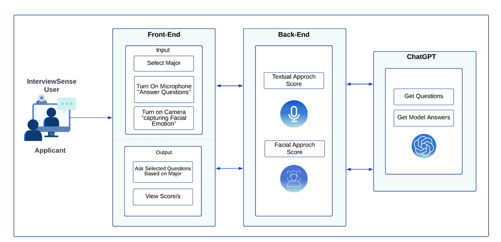

<p align="center">
  
</p>

# InterviewSense – Automatic Evaluation of Interview Applicant Performance

**InterviewSense** is an AI-powered web application designed to help applicants practice job interviews and receive automated feedback on both **verbal** and **non-verbal** performance.

The project was developed as a graduation project under the title:

> **Automatic Evaluation of Interview Applicant Performance using Different Modalities**

Instead of only asking interview questions, InterviewSense simulates an interview session, records spoken answers, analyzes answer relevance, observes facial emotions, and presents performance scores that help applicants understand their strengths and weaknesses.

---

## Problem Statement

Many students and fresh graduates prepare for interviews by reading common questions or practicing alone. However, this type of preparation usually lacks structured feedback.

The main problems addressed by InterviewSense are:

- Applicants may not know whether their answers are relevant, complete, or close to an expected answer.
- Traditional practice does not usually evaluate non-verbal behavior such as facial expressions.
- Interview feedback is often subjective, delayed, or unavailable without a mentor.
- Existing tools often focus on either questions, scoring, or speech, but not a combined multimodal evaluation.

InterviewSense was created to provide a more comprehensive interview training experience by combining answer evaluation with facial emotion analysis.

---

## Project Objectives

The main objective of InterviewSense is to design and implement a smart interview preparation system that evaluates applicant performance using multiple modalities.

The project focuses on:

- Generating customized interview questions based on the applicant’s selected major.
- Generating model answers for comparison.
- Converting spoken answers into text using Automatic Speech Recognition.
- Evaluating answer quality using semantic similarity.
- Detecting facial emotions during the interview session.
- Producing textual and facial performance scores.
- Providing a simple and user-friendly interface for interview practice.

---

## Proposed Solution

InterviewSense is a web-based system that combines **Generative AI**, **Speech-to-Text**, **Natural Language Processing**, and **Facial Emotion Recognition**.

The applicant starts by selecting a major. The system then generates seven interview questions and model answers. During the session, the applicant answers using the microphone, and the system can optionally use the camera to capture facial behavior. After the interview ends, InterviewSense evaluates the spoken answers and facial expressions, then displays the final performance results.

The solution is designed to support applicants in improving both:

1. **Verbal performance** – how relevant and complete their spoken answers are.
2. **Non-verbal performance** – what facial emotions appear during the interview.

---

## System Architecture

InterviewSense is structured around three main parts: the applicant-facing interface, the backend processing layer, and the AI services used for generation and evaluation.

<p align="center">
  
</p>

### Frontend

The frontend handles the applicant interaction. It allows the user to:

- Select a major.
- Enable the microphone to answer questions.
- Optionally enable the camera for facial emotion analysis.
- View generated questions.
- View textual and facial scores after the interview.

### Backend

The backend manages the system logic, including:

- User sessions.
- Question and model-answer generation.
- Audio transcription.
- Answer similarity calculation.
- Facial emotion analysis.
- Score calculation.
- Database operations.

### AI Components

The AI layer supports the core intelligence of the system:

- **ChatGPT / OpenAI API** generates interview questions and model answers.
- **AssemblyAI** converts spoken answers into text.
- **Sentence Transformers / BERT-based semantic representation** converts answers into embeddings.
- **Cosine Similarity** compares applicant answers with model answers.
- **DeepFace and OpenCV** analyze facial emotions from camera frames.

---

## System Workflow

```text
Applicant Login / Signup
        ↓
Select Major
        ↓
Enable Microphone and Optional Camera
        ↓
Generate Seven Interview Questions
        ↓
Applicant Answers Questions by Voice
        ↓
Convert Spoken Answers to Text
        ↓
Generate Model Answers
        ↓
Compare Applicant Answers with Model Answers
        ↓
Calculate Textual Score
        ↓
Analyze Facial Emotions from Frames
        ↓
Calculate Facial Emotion Summary
        ↓
Display Final Scores
```

---

## Key Features

- User signup and login.
- User profile page.
- Major-based interview question generation.
- Seven generated interview questions per session.
- AI-generated model answers.
- Voice-based answer recording.
- Speech-to-text transcription.
- Semantic answer scoring.
- Cosine similarity between applicant answers and model answers.
- Optional camera-based facial emotion analysis.
- Final score page for textual and facial performance.
- Contact form for user messages.
- Responsive web interface designed from Figma prototypes.

---

## Database Design

InterviewSense uses a lightweight SQLite database for the academic prototype and portfolio version.

The database is used to store registered users and contact messages. The local database file is excluded from the repository to avoid publishing personal data.

### Users Table

| Field | Purpose |
|---|---|
| `id` | Unique identifier for each user |
| `name` | User full name |
| `email` | User email address |
| `password` | User password in the original academic prototype |
| `major` | Selected major or field |

### Contacts Table

| Field | Purpose |
|---|---|
| `id` | Unique identifier for each message |
| `name` | Sender name |
| `email` | Sender email address |
| `message` | User message submitted through the contact form |

### Database Note

The repository does **not** include the local `database.db` file because it may contain user records. Instead, the database schema is represented in `init_db.py`.

---

## Textual Answer Evaluation

The textual evaluation component measures how close the applicant’s answer is to the model answer.

The process follows these steps:

1. The applicant answers the question using voice.
2. The audio answer is converted into text using AssemblyAI.
3. The system generates or retrieves a model answer.
4. Both answers are converted into numerical semantic representations.
5. Cosine similarity is calculated between the two answer vectors.
6. The similarity values are averaged to produce the final textual score.

The project compared multiple feature representation techniques, including **TF-IDF**, **Word2Vec**, and **BERT-based semantic representation**. Transformer-based semantic representation was selected because it captures meaning better than simple keyword matching.

---

## Facial Emotion Evaluation

The facial evaluation component analyzes non-verbal behavior during the interview.

The process follows these steps:

1. The applicant optionally enables the camera.
2. The system captures frames during the interview session.
3. Face detection is applied to identify the applicant’s face.
4. Facial emotions are detected using DeepFace.
5. Emotion results are aggregated across frames.
6. The system displays the final facial emotion summary.

This adds a non-verbal evaluation dimension to the platform, making InterviewSense more comprehensive than a simple question-answer practice tool.

---

## Experimental Results

The project evaluated the main components using different datasets and metrics.

### Speech-to-Text Evaluation

AssemblyAI and Microsoft Azure Speech-to-Text were compared using Word Error Rate (WER). AssemblyAI achieved the best result with a **3.98% WER** on the tested sample set, so it was selected for the system’s speech-to-text component.

### Text Similarity Evaluation

The project compared multiple textual feature representation methods:

| Method | Purpose |
|---|---|
| TF-IDF | Keyword-based text representation |
| Word2Vec | Word embedding representation |
| BERT-based representation | Context-aware semantic representation |

The results showed that BERT-based semantic representation was the most suitable choice for answer evaluation because it can better understand meaning and context.

### Facial Emotion Recognition Evaluation

For facial emotion recognition, the project compared DeepFace and FER techniques using FER-2013 and a customized interview-style dataset.

DeepFace with detector backends such as OpenCV and MTCNN showed strong performance. OpenCV was selected for the prototype because it provided a practical balance between speed and accuracy.

---

## Datasets Used in Evaluation

The academic evaluation phase referenced and used several datasets related to speech, text, and facial emotion analysis:

| Dataset | Usage |
|---|---|
| LibriSpeech ASR Corpus | Speech-to-text evaluation |
| ARTJI Q&A Dataset | Interview question-answer evaluation |
| ARTJI-Customized | Recorded answer evaluation |
| FER-2013 | Facial emotion recognition evaluation |
| FER-Customized | Interview-style facial emotion testing |

---

## Tech Stack

| Area | Technologies |
|---|---|
| Backend | Python, Flask |
| Database | SQLite |
| Generative AI | OpenAI API / ChatGPT |
| Speech Recognition | AssemblyAI |
| NLP Evaluation | Sentence Transformers, BERT-based embeddings, Cosine Similarity |
| Computer Vision | DeepFace, OpenCV, face-api.js |
| Frontend | HTML, CSS, JavaScript |
| Design | Figma, Anima |
| Development Tools | Visual Studio Code, Google Colab |

---

## Project Preview

<p align="center">
  
</p>

---

## Academic Poster

The poster summarizes the project motivation, objectives, architecture, workflow, experimental results, tools, and UI design.

<p align="center">
  
</p>

---

## Repository Notes

This repository is prepared as a clean portfolio version of the project. The following items are intentionally excluded:

- API keys
- Local `.env` file
- Local SQLite database file
- Temporary audio files
- Real user records
- Personal or sensitive data

The purpose of this repository is to present the project idea, system design, AI components, database structure, and academic evaluation results in a safe and professional format.

---

## Limitations

The current version has the following limitations:

- The system currently supports English answers only.
- The interview domain focuses mainly on computer science and engineering fields.
- Applicant score history is not stored for long-term progress tracking.
- The portfolio version is prepared for demonstration and documentation, not production deployment.

---

## Future Work

Planned improvements include:

- Supporting multiple languages.
- Expanding the system to more interview domains.
- Storing applicant scores to track progress over time.
- Improving feedback by showing detailed comments for each answer.
- Adding an admin dashboard for reviewing sessions and reports.
- Improving security with password hashing and stronger authentication.
- Preparing the system for deployment using Docker or cloud hosting.

---

## Author

**Shahad Alharbi**  
Computer Science Graduate  
Interested in AI Engineering, Data Analytics, and Backend Development.
